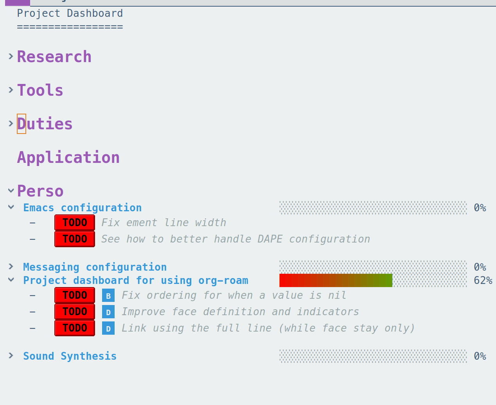

# A dashboard summarizing org-roam projects

A small helper to organize my project using the ORG ROAM structure.



## How to install

```elisp
(use-package org-roam-project-dashboard
  :ensure (org-roam-project-dashboard :type git :host github :repo "seblemaguer/org-roam-project-dashboard")
  :commands (org-roam-project-dashboard-show)
  :custom
  (org-roam-project-dashboard-list-tags '("research" "tools" "duties" "application" "perso"))
  (org-roam-project-dashboard-threshold-tasks 5))
```

## How to use

Simply call the function `org-roam-project-dashboard-show`.
